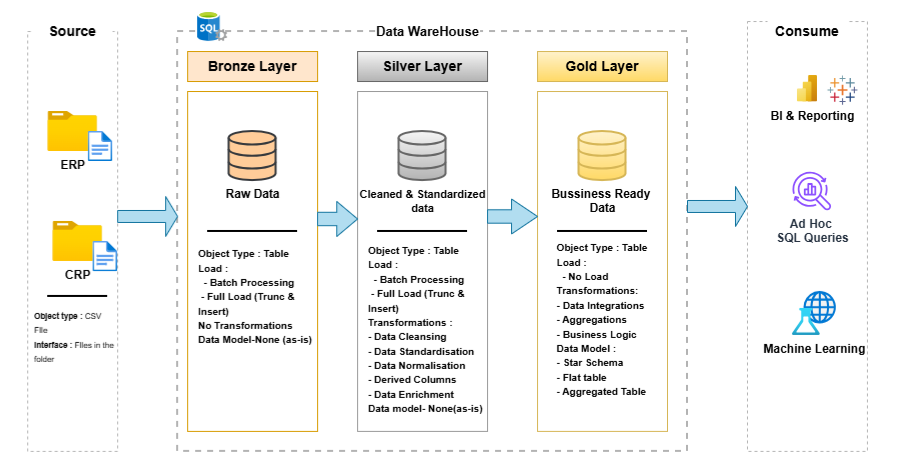
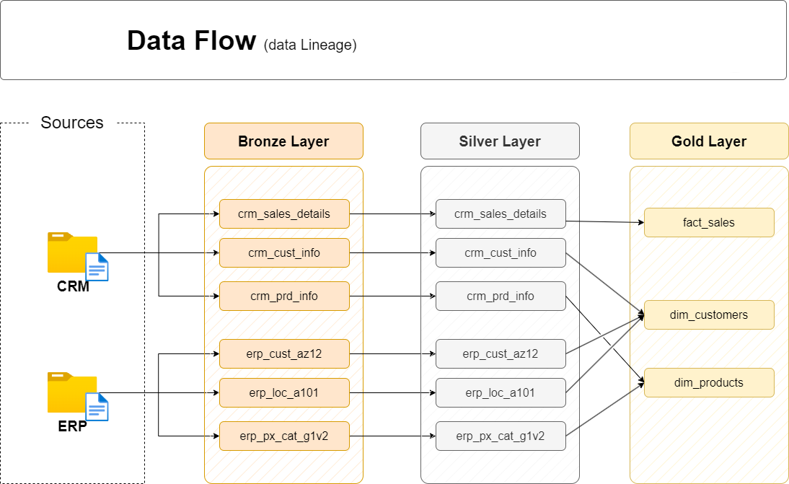
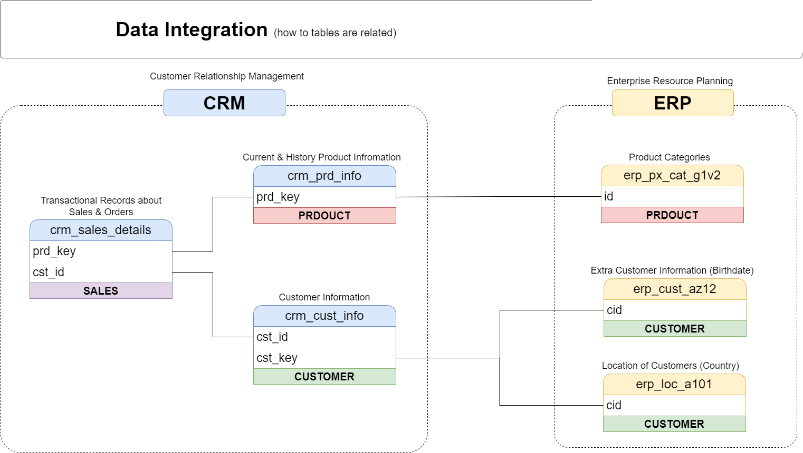
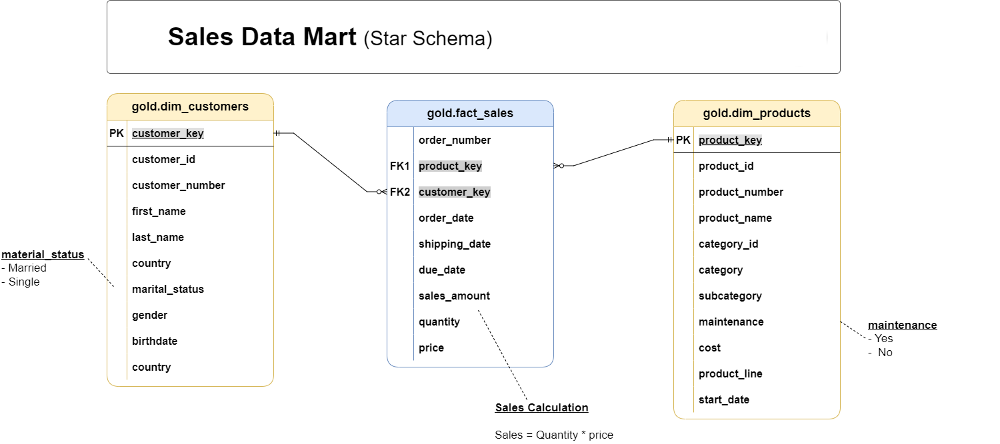

# 🏛️ Data Warehouse Project

> **A Modern Data Warehouse built with SQL Server — implementing the Medallion Architecture with full ETL Pipelines, Data Modeling.**

[](https://www.microsoft.com/en-us/sql-server)
[](https://github.com/trinay126/Data-Warehouse-Project-with-SQL)
[](LICENSE)
[]()

---

## 📋 Table of Contents

- [Project Overview](#-project-overview)
- [Data Architecture](#-data-architecture)
- [Data Flow & Lineage](#-data-flow--lineage)
- [Data Integration](#-data-integration)
- [Data Model — Star Schema](#-data-model--star-schema)
- [Data Catalog](#-data-catalog)
- [Naming Conventions](#-naming-conventions)
- [Repository Structure](#-repository-structure)
- [Tech Stack & Tools](#️-tech-stack--tools)
- [Getting Started](#-getting-started)
- [Project Scope](#-project-scope)
- [License](#-license)

---

## 🎯 Project Overview

This project demonstrates the end-to-end implementation of a **Modern Data Warehouse** using SQL Server. It consolidates data from two source systems — **CRM** and **ERP** — through a structured ETL pipeline into a clean, business-ready Star Schema.

### What This Project Covers

| Area | Description |
|------|-------------|
| 🏗️ **Data Architecture** | Medallion Architecture with Bronze, Silver, and Gold layers |
| ⚙️ **ETL Pipelines** | Stored procedures (`load_bronze`, `load_silver`) for extraction, transformation, and loading |
| 📐 **Data Modeling** | Fact and dimension tables using Star Schema |
| 📖 **Documentation** | Full data catalog, naming conventions, and architecture diagrams |

### Skills Demonstrated
`SQL Development` · `Data Architecture` · `ETL Engineering` · `Data Modeling` · `Data Quality`

---

## 🏗️ Data Architecture

The warehouse is built on the **Medallion Architecture** — a layered approach that progressively refines raw data into business-ready insights.



### Layer Breakdown

| Layer | Object Type | Load Strategy | Transformations | Data Model |
|-------|------------|---------------|-----------------|------------|
| 🥉 **Bronze** | Tables | Batch · Full Load · Truncate & Insert | None — data stored as-is | None |
| 🥈 **Silver** | Tables | Batch · Full Load · Truncate & Insert | Cleansing · Standardisation · Normalisation · Derived Columns · Enrichment | None |
| 🥇 **Gold** | Views | No Load | Data Integrations · Aggregations · Business Logic | Star Schema |

---

## 🔄 Data Flow & Lineage

End-to-end data lineage from raw CSV source files through every warehouse layer to the final Gold analytical tables.



| Source System | Bronze Layer | Silver Layer | Gold Layer |
|---------------|-------------|-------------|------------|
| CRM | `crm_sales_details` | `crm_sales_details` | `fact_sales` |
| CRM | `crm_cust_info` | `crm_cust_info` | `dim_customers` |
| CRM | `crm_prd_info` | `crm_prd_info` | `dim_products` |
| ERP | `erp_cust_az12` | `erp_cust_az12` | `dim_customers` |
| ERP | `erp_loc_a101` | `erp_loc_a101` | `dim_customers` |
| ERP | `erp_px_cat_g1v2` | `erp_px_cat_g1v2` | `dim_products` |

---

## 🔗 Data Integration

Shows how CRM and ERP source tables relate to each other and how they are unified in the Silver integration layer.



**Key Join Relationships:**

| Left Table | Join Key | Right Table | Domain |
|------------|----------|-------------|--------|
| `crm_sales_details` | `prd_key` | `crm_prd_info` | Sales → Product |
| `crm_sales_details` | `cst_id` | `crm_cust_info` | Sales → Customer |
| `crm_cust_info` | `cst_key` / `cid` | `erp_cust_az12` | CRM ↔ ERP Customer |
| `crm_cust_info` | `cst_key` / `cid` | `erp_loc_a101` | CRM ↔ ERP Location |
| `crm_prd_info` | `PRODUCT` key | `erp_px_cat_g1v2` | CRM ↔ ERP Product Category |

---

## 📐 Data Model — Star Schema

The Gold layer is structured as a **Sales Data Mart** using a Star Schema for fast, optimized analytical querying.



> 💡 **Sales Calculation:** `sales_amount = quantity × price`

The star schema connects one central fact table to two dimension tables via surrogate keys:
- `fact_sales.product_key` → `dim_products.product_key`
- `fact_sales.customer_key` → `dim_customers.customer_key`

---

## 📖 Data Catalog

Full column-level documentation for all Gold layer tables.

### `gold.dim_customers`
> Stores customer details enriched with demographic and geographic data sourced from CRM and ERP systems.

| Column | Data Type | Key | Description |
|--------|-----------|-----|-------------|
| `customer_key` | INT | 🔑 PK | Surrogate key — uniquely identifies each customer record |
| `customer_id` | INT | | Unique numerical identifier from the source system |
| `customer_number` | NVARCHAR(50) | | Alphanumeric identifier used for tracking and referencing |
| `first_name` | NVARCHAR(50) | | Customer's first name as recorded in the system |
| `last_name` | NVARCHAR(50) | | Customer's last name / family name |
| `country` | NVARCHAR(50) | | Country of residence (e.g., `Australia`) |
| `marital_status` | NVARCHAR(50) | | Marital status: `Married` or `Single` |
| `gender` | NVARCHAR(50) | | Gender: `Male`, `Female`, or `n/a` |
| `birthdate` | DATE | | Date of birth — format `YYYY-MM-DD` (e.g., `1971-10-06`) |
| `create_date` | DATE | | Date the customer record was created in the system |

---

### `gold.dim_products`
> Provides product details and attributes for analytical use, combining CRM product info with ERP category data.

| Column | Data Type | Key | Description |
|--------|-----------|-----|-------------|
| `product_key` | INT | 🔑 PK | Surrogate key — uniquely identifies each product record |
| `product_id` | INT | | Unique internal identifier for the product |
| `product_number` | NVARCHAR(50) | | Structured alphanumeric code for categorization/inventory |
| `product_name` | NVARCHAR(50) | | Descriptive name including type, color, and size |
| `category_id` | NVARCHAR(50) | | Links to the product's high-level classification |
| `category` | NVARCHAR(50) | | Broad classification (e.g., `Bikes`, `Components`) |
| `subcategory` | NVARCHAR(50) | | Detailed classification within the category (e.g., product type) |
| `maintenance_required` | NVARCHAR(50) | | Whether maintenance is needed: `Yes` or `No` |
| `cost` | INT | | Base cost/price of the product in monetary units |
| `product_line` | NVARCHAR(50) | | Product line or series (e.g., `Road`, `Mountain`) |
| `start_date` | DATE | | Date the product became available for sale |

---

### `gold.fact_sales`
> Stores transactional sales data for analytical purposes. Central table of the star schema.

| Column | Data Type | Key | Description |
|--------|-----------|-----|-------------|
| `order_number` | NVARCHAR(50) | | Unique alphanumeric identifier for each sales order (e.g., `SO54496`) |
| `product_key` | INT | 🔗 FK1 | Links to `dim_products.product_key` |
| `customer_key` | INT | 🔗 FK2 | Links to `dim_customers.customer_key` |
| `order_date` | DATE | | Date when the order was placed |
| `shipping_date` | DATE | | Date when the order was shipped to the customer |
| `due_date` | DATE | | Date when the order payment was due |
| `sales_amount` | INT | | Total monetary value of the sale (`quantity × price`) |
| `quantity` | INT | | Number of units ordered for the line item |
| `price` | INT | | Price per unit in whole currency units (e.g., `25`) |

---

## 📏 Naming Conventions

All objects in this warehouse follow consistent naming standards to ensure clarity and maintainability.

### General Principles

- **Format:** `snake_case` — lowercase letters with underscores (`_`) separating words
- **Language:** English for all names
- **Rule:** Avoid SQL reserved words as object names

---

### Table Naming

| Layer | Pattern | Rule | Example |
|-------|---------|------|---------|
| 🥉 **Bronze** | `<sourcesystem>_<entity>` | Match source table name exactly — no renaming | `crm_cust_info` |
| 🥈 **Silver** | `<sourcesystem>_<entity>` | Match source table name exactly — no renaming | `erp_cust_az12` |
| 🥇 **Gold** | `<category>_<entity>` | Use meaningful, business-aligned names with category prefix | `dim_customers`, `fact_sales` |

#### Gold Layer Category Prefixes

| Prefix | Meaning | Examples |
|--------|---------|---------|
| `dim_` | Dimension table | `dim_customers`, `dim_products` |
| `fact_` | Fact table | `fact_sales` |
| `report_` | Reporting table | `report_sales_monthly` |

---

### Column Naming

| Type | Pattern | Rule | Example |
|------|---------|------|---------|
| **Surrogate Keys** | `<table_name>_key` | All primary keys in dimension tables use `_key` suffix | `customer_key`, `product_key` |
| **Technical Columns** | `dwh_<column_name>` | System-generated metadata uses `dwh_` prefix | `dwh_load_date` |

---

### Stored Procedure Naming

| Pattern | Rule | Examples |
|---------|------|---------|
| `load_<layer>` | All data-loading stored procedures are prefixed by their target layer | `load_bronze`, `load_silver` |

---

## 📂 Repository Structure

```
Data-Warehouse-Project-with-SQL/
│
├── 📁 datasets/                        # Raw source data (CSV files)
│   ├── source_crm/
│   │   ├── cust_info.csv               # CRM customer data
│   │   ├── prd_info.csv                # CRM product data
│   │   └── sales_details.csv           # CRM sales transactions
│   └── source_erp/
│       ├── CUST_AZ12.csv               # ERP customer extra info (birthdate)
│       ├── LOC_A101.csv                # ERP customer location (country)
│       └── PX_CAT_G1V2.csv            # ERP product categories
│
├── 📁 docs/                            # Architecture diagrams & documentation
│   ├── data_architecture.png           # High-level Medallion Architecture diagram
│   ├── data_flow.png                   # Data lineage flow diagram
│   ├── data_integration.png            # Table relationship & join diagram
│   ├── data_model.png                  # Star schema data model (Sales Data Mart)
│   ├── architecture_drawio.png         # Draw.io architecture overview
│   ├── data_catalog.md                 # Full column-level field descriptions
│   └── naming-conventions.md           # Naming standards for all objects
│
├── 📁 scripts/                         # SQL scripts for ETL
│   ├── bronze/                         # load_bronze — raw data loading stored procedures
│   ├── silver/                         # load_silver — cleansing & transformation scripts
│   └── gold/                           # Analytical views & Sales Data Mart creation
│
├── 📁 tests/                           # Data quality & validation scripts
│
├── README.md                           # Project overview (this file)
├── LICENSE                             # MIT License
└── .gitignore                          # Git ignore rules
```

---

## 🛠️ Tech Stack & Tools

| Tool | Purpose | Link |
|------|---------|------|
| **SQL Server Express** | Database engine & warehouse host | [Download](https://www.microsoft.com/en-us/sql-server/sql-server-downloads) |
| **SSMS** | GUI for database management & query execution | [Download](https://learn.microsoft.com/en-us/sql/ssms/download-sql-server-management-studio-ssms) |
| **T-SQL / Stored Procedures** | ETL automation (`load_bronze`, `load_silver`) | — |
| **Draw.io** | Architecture, data flow, and model diagrams | [drawio.com](https://www.drawio.com/) |
| **Git / GitHub** | Version control & collaboration | [github.com](https://github.com) |

---

## 🚀 Getting Started

### Prerequisites

- [SQL Server Express](https://www.microsoft.com/en-us/sql-server/sql-server-downloads) (free)
- [SQL Server Management Studio (SSMS)](https://learn.microsoft.com/en-us/sql/ssms/download-sql-server-management-studio-ssms)
- Git

### Setup Steps

**1. Clone the repository**
```bash
git clone https://github.com/trinay126/Data-Warehouse-Project-with-SQL.git
cd Data-Warehouse-Project-with-SQL
```

**2. Place datasets on your SQL Server machine**

Copy the CSV files from `datasets/` to a location accessible by SQL Server (e.g., `C:\datasets\`).

**3. Run Bronze layer — load raw data**
```sql
EXEC load_bronze;
```

**4. Run Silver layer — cleanse & standardize**
```sql
EXEC load_silver;
```

**5. Query the Gold layer — business-ready views**
```sql
SELECT * FROM gold.fact_sales;
SELECT * FROM gold.dim_customers;
SELECT * FROM gold.dim_products;
```

---

## 📋 Project Scope

### Data Engineering

**Objective:** Build a Modern Data Warehouse on SQL Server to consolidate CRM and ERP sales data into a clean, query-ready data model.

| Requirement | Detail |
|-------------|--------|
| **Sources** | ERP and CRM systems — delivered as CSV files |
| **Data Quality** | Cleanse and resolve issues before loading to Silver |
| **Integration** | Combine both sources into a unified Star Schema |
| **Scope** | Latest data only — no historization required |
---

## 🛡️ License

This project is licensed under the [MIT License](LICENSE) — free to use, modify, and distribute with proper attribution.

---

<div align="center">

⭐ **Found this useful? Give it a star!** ⭐

</div>
